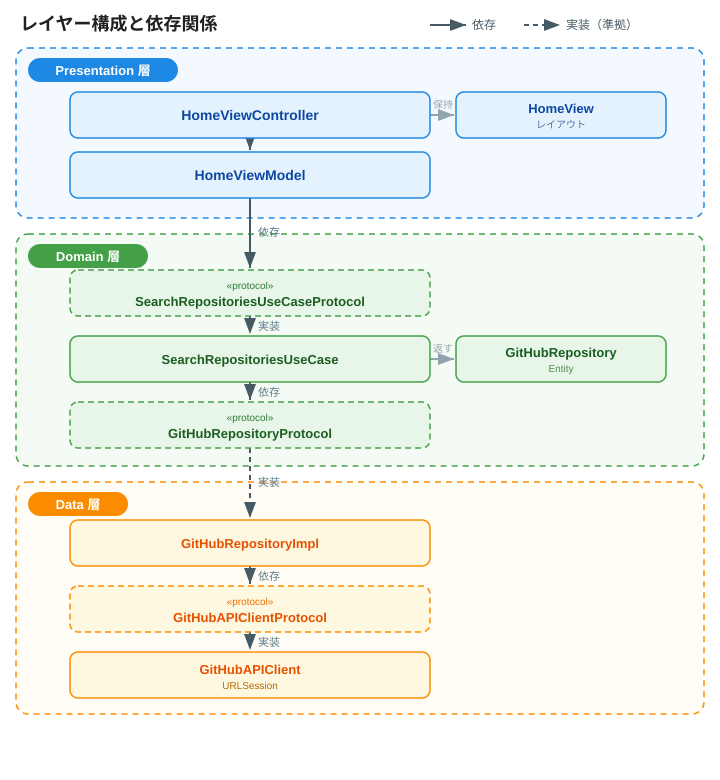
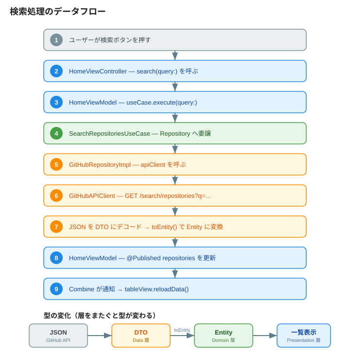

# アーキテクチャ設計ドキュメント

本プロジェクトは、GitHubリポジトリ検索アプリを題材に **MVVM + クリーンアーキテクチャ** を学習・実践するためのものです。UIKit（コードベースUI）と Swift Concurrency（async/await）、Combine を用いています。

## 目次

- [全体像](#全体像)
- [レイヤー構成](#レイヤー構成)
- [依存関係の方向](#依存関係の方向)
- [データフロー（検索処理）](#データフロー検索処理)
- [各コンポーネントの責務](#各コンポーネントの責務)
- [特に注目すべき設計ポイント](#特に注目すべき設計ポイント)
- [ディレクトリ構成](#ディレクトリ構成)
- [今後の改善点](#今後の改善点)

## 全体像

3つのレイヤーで構成されています。

| レイヤー | 役割 | 主なコンポーネント |
|----------|------|--------------------|
| Presentation | 画面表示・ユーザー操作・表示状態の管理 | HomeView / HomeViewController / HomeViewModel |
| Domain | アプリの中心概念とビジネスロジック（他層に依存しない） | GitHubRepository / GitHubRepositoryProtocol / SearchRepositoriesUseCase |
| Data | 外部データ源（GitHub API）との通信と型変換 | GitHubAPIClient / DTO / Mapper / GitHubRepositoryImpl |

## レイヤー構成



- 角丸破線のボックスが **プロトコル（抽象）**、実線のボックスが **具象** です。
- 実線矢印が「依存」、破線矢印が「実装（準拠）」を表します。**上位が抽象に依存し、具象がそれを実装する**（＝依存性逆転 / DIP）流れが、上から下へたどれます。

## 依存関係の方向

クリーンアーキテクチャの核心は **「依存は常に内側（Domain）へ向かう」** ことです。

```
Presentation ──▶ Domain ◀── Data
                (中心・独立)
```

- **Domain は何にも依存しない**（最も安定した中心）
- **Presentation / Data は Domain に依存する**（外側）
- Data → Domain の依存は、Data が Domain の**プロトコルを実装する**ことで成立（＝依存性逆転 / DIP）

> ポイント：`GitHubRepositoryImpl`（Data）は `GitHubRepositoryProtocol`（Domain）に準拠する。つまり「実装（外側）が抽象（内側）に従う」ため、Domain は Data の存在を知らずに済む。

## データフロー（検索処理）

検索ボタン押下から一覧更新までの流れです。層をまたぐごとに、データの型が **DTO → Entity** と変化します。



## 各コンポーネントの責務

### Presentation 層

| コンポーネント | 責務 |
|----------------|------|
| `HomeView` | サブビュー生成とAuto Layout（レイアウトのみ） |
| `HomeViewController` | UIKitの配線（delegate/dataSource接続）、ViewModelの購読、UI更新 |
| `HomeViewModel` | 表示状態（`repositories`）の保持、UseCase呼び出し、状態更新をメインスレッドで保証 |

### Domain 層

| コンポーネント | 責務 |
|----------------|------|
| `GitHubRepository` | アプリが扱うリポジトリの純粋な表現（取得手段に非依存） |
| `GitHubRepositoryProtocol` | データ取得の抽象（契約）。実装はData層 |
| `SearchRepositoriesUseCase(+Protocol)` | 検索というユースケース。Repository を組み合わせるビジネスロジック |

### Data 層

| コンポーネント | 責務 |
|----------------|------|
| `GitHubAPIClient(+Protocol)` | URLSessionによる通信とJSONデコード |
| `RepositorySearchResponseDTO` 他 | APIレスポンス構造に対応する型（`Codable`） |
| `RepositoryDTO.toEntity()` | DTO → Entity への変換（Mapper） |
| `GitHubRepositoryImpl` | `GitHubRepositoryProtocol` の実装。API取得＋変換を統合 |

## 特に注目すべき設計ポイント

### 1. 依存性逆転（DIP）とプロトコル

各層の境界にプロトコルを置き、上位が下位の**具象**でなく**抽象**に依存させています。

- `HomeViewModel` → `SearchRepositoriesUseCaseProtocol`
- `SearchRepositoriesUseCase` → `GitHubRepositoryProtocol`
- `GitHubRepositoryImpl` → `GitHubAPIClientProtocol`

これにより、各コンポーネントを**テスト時にモックへ差し替え可能**になります。

### 2. DTO と Entity の分離

APIの都合（`full_name` のスネークケース、ネストした `owner` オブジェクト）は **DTO** が吸収し、Domain の **Entity** には持ち込みません。API仕様が変わってもData層の修正に留まります。

### 3. Entity の純粋性と Sendable

`GitHubRepository` は不変（`let`）な値型で、`Codable` を持たず取得手段を知りません。全プロパティが `Sendable` なため、Swift 6 の並行性チェック下でも**アクター境界を安全に越えられます**。

### 4. Swift Concurrency と @MainActor

- 通信は `URLSession` の async API が**メイン以外のスレッド**で実行（`await` 中はメインを解放）
- ViewModel の `search(query:)` は `@MainActor` で、UIに直結する `repositories` の更新を**メインスレッドで保証**

### 5. Combine によるデータバインディング

`@Published var repositories` を ViewController が購読し、変更時に自動で `reloadData()`。View と状態の同期を宣言的に実現しています。

## ディレクトリ構成

```
MVVM+CleanArchitecturePractice/
├── Presentation/
│   ├── View/HomeView.swift
│   ├── ViewController/HomeViewController.swift
│   └── ViewModel/HomeViewModel.swift
├── Domain/
│   ├── Entity/GitHubRepository.swift
│   ├── Repository/GitHubRepositoryProtocol.swift
│   └── UseCase/SearchRepositoriesUseCase.swift
└── Data/
    ├── API/GitHubAPIClient.swift
    ├── API/APIError.swift
    ├── DTO/RepositorySearchResponseDTO.swift
    ├── Mapper/RepositoryDTO+Mapping.swift
    └── Repository/GitHubRepositoryImpl.swift
```

## 今後の改善点

| 優先度 | 内容 |
|--------|------|
| 中 | **Composition Root化**：現状 `HomeViewController` が `GitHubRepositoryImpl` 等のData層具象を生成している。依存の組み立てを `SceneDelegate` へ移し、VCはViewModelを注入で受け取る形にする |
| 小 | **エラー状態のUI反映**：ViewModelがエラーを`print`のみ。`@Published` なエラー状態を持たせて表示する |
| 小 | **ローディング状態**：通信中インジケータの表示 |
| 小 | **`cell.textLabel` の置き換え**：`UIListContentConfiguration` を使用 |
